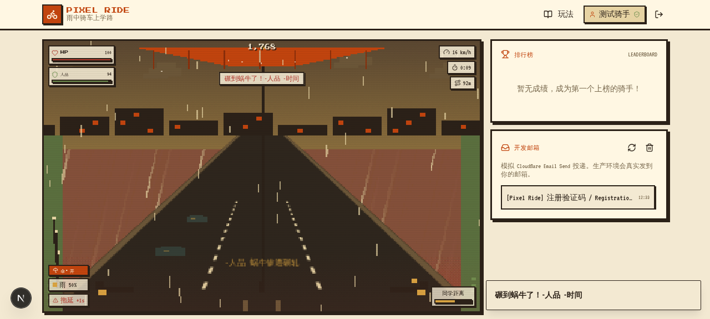
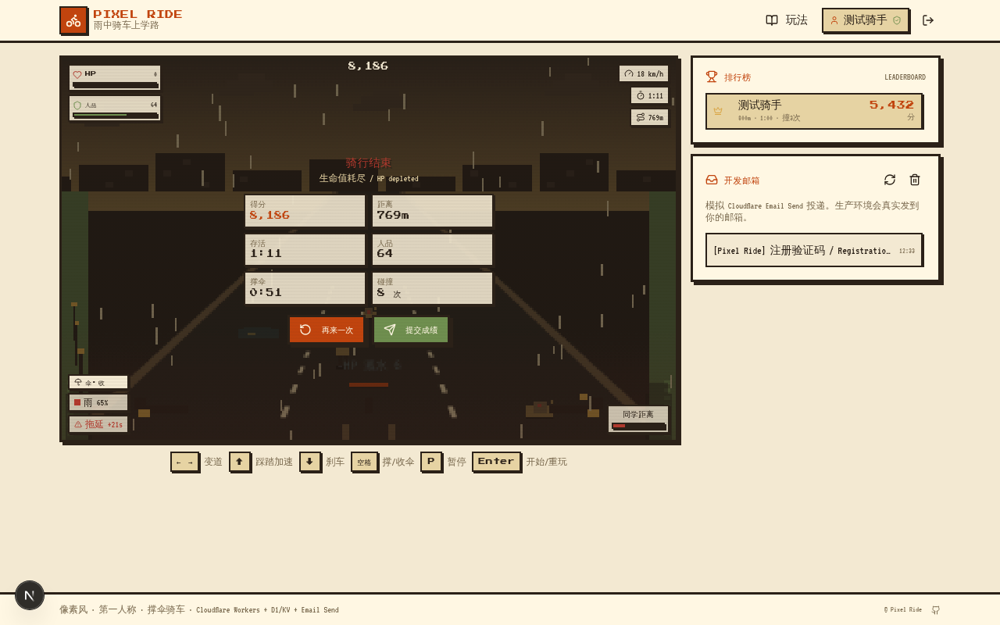

# Pixel Ride · 雨中骑车上学路

> 一个吐槽 2026/06/26 厦门大雨的像素风第一人称骑车网页游戏。
> 清晨下暴雨，可你还得骑车去上学。一手撑伞，一手扶把，
> 蜗牛在路面慢吞吞地爬，行人在斑马线上踱步，水坑一个接一个——
> 最糟的是，迟到的同学正在后面猛追，想抄你的车把！




---

## 特性

- **第一人称像素渲染** — 320×200 低分辨率，硬边像素，暖色大地系调色（terracotta / sepia / moss / wheat），CRT 扫描线质感，无蓝紫。
- **撑伞系统** — 空格切换。撑伞速度 −20%，水坑溅水伤害 −75%，雨天缓慢回血；收伞全速但雨大时持续掉血。
- **同学追逐** — 保持高速（>0.4）才能甩开，低速被追近，碰撞额外拉近，归零即被追上 = 游戏结束。近距离有红色追赶剪影 + 红色 vignette 脉动警告。
- **障碍与事件** — 蜗牛（碾到 −人品 +拖延）、横穿马路的行人（50% 被揍 −HP / 50% 被骂 −人品）、水坑（伤害 = 速度 × 水深）、热咖啡拾取（+HP +Combo 拉开同学）。
- **天气与难度曲线** — 雨强 0~1 随机波动，影响掉血与水坑深度；刷怪间隔 1.5s→0.55s，90s 后双倍刷怪。
- **账号系统** — 邮箱注册 + PBKDF2 密码哈希 + HMAC 签名 session cookie；6 位验证码（15 分钟有效）；成绩提交需已验证账号；前 20 排行榜。
- **开发邮箱面板** — 沙箱环境下验证码写入 `DevMail` 表，可在应用内直接查看并一键填入，端到端可玩。
- **响应式** — 桌面键位 + 移动端虚拟按键，390×844 适配。

## 操作

| 按键 | 动作 |
|------|------|
| `←` `→` / `A` `D` | 左右变道 |
| `↑` / `W` | 踩踏加速（甩开同学） |
| `↓` / `S` | 刹车减速 |
| `空格` | 撑起 / 收起雨伞 |
| `P` | 暂停 |
| `Enter` | 开始 / 重玩 |

移动端使用屏幕虚拟按键。

## 技术栈

- **Next.js 16**（App Router）+ **TypeScript** + **React 19**，经 [`@opennextjs/cloudflare`](https://opennext.js.org/cloudflare) 适配到 Cloudflare Workers
- **Tailwind CSS 4** + **shadcn/ui**（new-york）
- **Cloudflare D1**（经 `@prisma/adapter-d1`，Prisma 驱动）+ **Email Send** + **KV**
- 密码哈希 WebCrypto PBKDF2，session 用 HMAC 签名 cookie（无服务端存储，适配 Workers 无状态）

## 项目结构

```
src/
├─ app/
│  ├─ api/                # 路由处理器
│  │  ├─ auth/{register,login,logout,me,verify}/
│  │  ├─ scores/          # 提交成绩（需验证）+ 个人历史
│  │  ├─ leaderboard/     # 前 20 排行榜
│  │  └─ devmail/         # 开发邮箱读取/清空
│  ├─ layout.tsx · page.tsx · globals.css
├─ components/
│  ├─ game/               # PixelRideGame / AuthPanel / VerifyPanel / DevMailbox / Leaderboard
│  └─ ui/                 # shadcn/ui 组件
├─ lib/
│  ├─ auth.ts             # WebCrypto PBKDF2 哈希 + HMAC session
│  ├─ cloudflare.ts       # getEnv()：从 getCloudflareContext() 取 D1/KV/Email 绑定
│  ├─ db.ts               # getPrisma()：PrismaClient + @prisma/adapter-d1（binding pixel_ride）
│  ├─ email.ts            # 生产 env.MAILER.send(EmailMessage)，dev 落 DevMail
│  └─ game/engine.ts      # 像素游戏引擎
└─ hooks/
prisma/schema.prisma      # Prisma schema（driverAdapters，类型源）
migrations/0001_init.sql  # D1 初始 schema（User/Score/VerificationCode/DevMail）
wrangler.toml             # Cloudflare Workers 部署配置
open-next.config.ts       # OpenNext 构建配置
```

## 本地开发

需要 Node 20+ 与 npm。本地 dev 经 OpenNext 的 `initOpenNextCloudflareForDev()` 启动 miniflare，让 `next dev` 也能拿到 wrangler.toml 的 D1/KV/Email 绑定。

```bash
npm install
cp .env.example .env            # 编辑 SESSION_SECRET（DATABASE_URL 仅给 prisma generate 用，运行时不连）
npm run db:generate             # 生成 Prisma client（含 driverAdapters）
npm run cf:types                # 生成 worker-configuration.d.ts（D1/KV/Email 类型）
npm run d1:migrate:local        # 本地 miniflare D1 建表
npm run dev                     # http://localhost:3000
```

常用脚本：

```bash
npm run lint                  # ESLint
npm run d1:query:local "SQL"  # 本地 D1 查询，如 "SELECT * FROM User"
npm run build                 # Next.js 构建
```

> 本地 dev 下邮件不发真信，验证码落 DevMail 表，可在页面右侧 **开发邮箱** 面板查看，或读终端 `[mail] ...` 日志。

## Cloudflare 部署

Next.js App Router 跑在 Workers 上，经 [`@opennextjs/cloudflare`](https://opennext.js.org/cloudflare) 把 `next build` 产物编译成单个 Worker。

### 1. 安装依赖

```bash
npm install
```

### 2. 创建 D1 并写回 database_id

```bash
wrangler login
wrangler d1 create pixel-ride
# 把返回的 database_id 填入 wrangler.toml 的 database_id（含 env.production）
```

### 3. 应用 D1 迁移

```bash
npm run d1:migrate:remote     # wrangler d1 migrations apply pixel-ride --remote
```

### 4. 设置密钥

```bash
wrangler secret put SESSION_SECRET      # 32+ 位随机串：openssl rand -hex 32
```

### 5. 生成类型、构建并部署

```bash
npm run db:generate           # prisma generate（含 driverAdapters client）
npm run cf:types              # wrangler types → worker-configuration.d.ts
npm run cf:build              # opennextjs-cloudflare build → .open-next/
npm run cf:deploy             # wrangler deploy
npm run cf:tail               # 实时日志
```

### Email Send 绑定

`wrangler.toml` 已声明 `[[send_email]] name = "MAILER"`，`src/lib/email.ts` 生产环境直接调用 `env.MAILER.send(new EmailMessage(from, to, mimeMsg))`，MIME 由 `mimetext` 构造。两种模式二选一：

- **已验证收件地址（测试）**：`destination_address = "已验证邮箱"`（仅能发往该地址）。
- **自定义域名（生产）**：`enabled = true` + 在发件域名配置 SPF/DKIM 验证。

本地 dev 不发真信，验证码落 DevMail 表供「开发邮箱」面板查看。

### 自动部署（Cloudflare Workers Builds）

用 Cloudflare Workers 内置 Git 集成（Workers Builds）：push 到 `main` 自动构建部署 Worker。在 Workers 项目 → Settings → Builds 里配：

- **Build command**: `npm run build:worker`（= `prisma generate && opennextjs-cloudflare build`，产 `.open-next/worker.js`）
- **Deploy command**: `npx wrangler deploy`

> 不要用 `npm run build`（= `next build`）—— 那产 `.next/standalone`，不是 OpenNext Worker，wrangler deploy 会找不到 `main` 文件。

Workers Builds 会自动注入 `CLOUDFLARE_API_TOKEN` / `CLOUDFLARE_ACCOUNT_ID` 给 build 环境，无需手动配 secret。

`SESSION_SECRET` 经 `wrangler secret put SESSION_SECRET` 注入一次（本地或 dashboard），不在仓库。

首次部署前先本地手动建表：

```bash
npm run d1:migrate:remote        # 远程 D1 建表
```

## 部署就绪状态

D1（Prisma adapter）+ Email Send + auth 均切到 Workers 原生实现，本地 dev 与生产同源代码：

| 模块 | 实现 |
|------|------|
| 前端 / 游戏引擎 | Next.js + Canvas，OpenNext 构建到 Workers |
| 路由 / API | Next.js route handler，Node runtime 经 `nodejs_compat` |
| 数据访问 `db.ts` | Prisma + `@prisma/adapter-d1`（binding `pixel_ride`），`getCloudflareContext()` 取 env |
| 密码哈希 `auth.ts` | WebCrypto PBKDF2（单次 `deriveBits`，不超 Workers CPU 限制） |
| session | HMAC-SHA256 签名 cookie，无服务端存储 |
| 邮件 `email.ts` | 生产 `env.MAILER.send(EmailMessage)`；dev 落 DevMail 表 |

### 部署前需验证（网络受限，无法在线确认精确 API）

1. **Prisma WASM engine** — Workers 不能跑 rust native query engine。确认 `@prisma/client` 在边缘用 WASM engine 生成。参考 Prisma 官方 Cloudflare D1 部署文档，可能需 `binaryTargets` 或 edge engine 配置。`npm run cf:build` 后若报 query engine 相关错误即此问题。
2. **Workers 包大小** — Prisma WASM client 较大，免费版 Workers 1MB 压缩限制可能超限；付费版 10MB。`cf:build` 输出体积需检查。
3. **`getCloudflareContext()` 形式** — 当前同步调用。OpenNext 版本若需 async，改 `await getCloudflareContext({ async: true })`。
4. **Email Send API** — 当前用 CF 标准 `new EmailMessage(from, to, mimeMsg)` + `mimetext` + `cloudflare:email` 模块。若你用的新版对象式 API 不同，改 `src/lib/email.ts`。

> `db/custom.db` 为本地旧 SQLite 遗留，运行时不使用，可删。

## 路线图

- 每日挑战 / 道具商店（雨衣、车铃、加速水）/ 成就系统 / 好友对战
- 路面类型（减速带、下坡加速、逆风）、Boss 同学、昼夜循环
- 像素字体按钮 hover、过场动画、角色与场景选择（校园/公园/闹市）
- Web Audio 合成 8-bit 音效（车铃、碰撞、雨声、心跳警告）
- 排行榜分页 / 维度排序 / 个人最佳高亮 / 反作弊阈值

## 许可证

见 [LICENSE](./LICENSE)。
